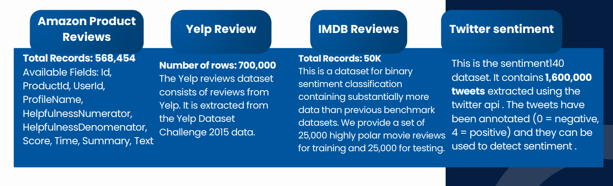
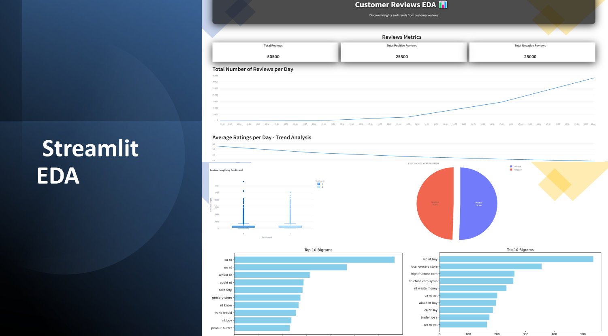

<!-- @format -->

# Customer Sentiment and Trend Analysis

## overview:

The project analyzes customer sentiment and trend analysis of IMDB reviews, Twitter tweets and comments on various products, YELP reviews and amazon product reviews and ratings.

The project includes preprocessing and filtering data and using different machine learning models like: Random Forest, logistic regression, K-Nearest Neighbors (KNN), XGBoost andAdaBoost, Gradient Boosting on the data after cleansing the data and using deep learning models like: Long Short-Term Memory (LSTM) and BERT (Bidirectional Encoder Representations from Transformers), Multi-Layer Perceptron (MLP), Gated Recurrent Unit (GRU).

The project implements platforms like: Hugging face, MLflow and Streamlit, for model optimization tracking and deployment.

The project uses libraries like pandas, NumPy, matplotlib, seaborn, NLTK, Scikit-learn,TensorFlow to preprocess and analyze and clean the data and make operations and visualize the data, and training machine learning models and deep learning models on the data.

### We performed sentiment analysis on these Datasets:

- [IMDb reviews](https://www.kaggle.com/datasets/lakshmi25npathi/imdb-dataset-of-50k-movie-reviews)
- [Twitter sentiment analysis](https://www.kaggle.com/datasets/kazanova/sentiment140)
- [yelp reviews](https://huggingface.co/datasets/Yelp/yelp_review_full)
- [Amazon product reviews](https://www.kaggle.com/datasets/arhamrumi/amazon-product-reviews/data)

## Team Members:

- [Mohamed Mostafa](https://www.linkedin.com/in/mohamed-mostafaaa/)
- [Moaz Tawfik](https://www.linkedin.com/in/moaz-tawfik-b276502a7/)
- [Mohamed Talaat](https://www.linkedin.com/in/mohamed-talaat-2751998de/)

## Deployment

Built with Streamlit for an intuitive user experience.
Deployed on Azure for scalability.
Integrated with MLflow to monitor model performance and simplify deployment.

**Trend analysis**

Project Links:

- [Deploy with streamlit](https://depisentimentanalysisapp-11-6-2024.streamlit.app/)
- [Deployed on Azure](https://depisentimentanalysis-fsgggqe3fqbhdndm.eastus-01.azurewebsites.net/)
- [Hugging Face Model](https://huggingface.co/spaces/MoazTawfik/Customer_Sentiment_Analysis)
